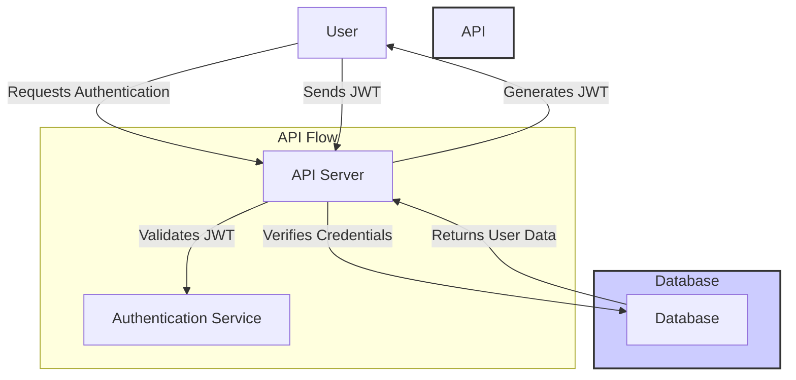

To create a Node.js API with authentication, I'll guide you through setting up a basic API using Node.js, Express, and JWT (JSON Web Token) for authentication. We will also use MongoDB as the database for storing users, bcryptjs for password hashing, and dotenv for environment variables.



# Node.js Authentication API

This is a simple Node.js API that implements user authentication using MongoDB, JWT, and Passport.js. It supports user registration, login, and protected routes.

## Features
- User registration with hashed passwords
- User login with JWT-based authentication
- Protected routes accessible only to authenticated users
- MongoDB for database storage

## Requirements
- [Node.js](https://nodejs.org/) (v14 or later)
- [MongoDB Atlas](https://www.mongodb.com/cloud/atlas) or Local MongoDB instance

## Getting Started

### 1. Clone the Repository
```bash
git clone https://github.com/muhammadsziyad/nodejs-auth-api-jwt.git
cd nodejs-auth-api-jwt
```

### 2. Install Dependencies

```bash
npm install
```
### 3. Set Up MongoDB
You can use either MongoDB Atlas (cloud) or a local MongoDB instance.

Option 1: MongoDB Atlas (Cloud)
- Create a free account at MongoDB Atlas.
- Create a cluster, add a database user, and whitelist your IP.
-  Get your connection string and replace <username>, <password>, and <dbname> with your actual details in the .env file.

Option 2: Local MongoDB
- Install MongoDB.
- Run mongod to start the MongoDB server locally.
- Use the local connection string in the .env file:
```bash
MONGO_URI=mongodb://localhost:27017/your-database-name
```

### 4. Create a .env File
In the root of the project, create a .env file and add the following environment variables:

```bash
MONGO_URI=mongodb+srv://<username>:<password>@cluster0.mongodb.net/<dbname>?retryWrites=true&w=majority
JWT_SECRET=your_jwt_secret_key
PORT=5000
```

- Replace <username>, <password>, and <dbname> with your MongoDB credentials.
- Set JWT_SECRET to a secure random string for signing JWT tokens.

### 5. Start the Server

```bash
npm start
```

The API will be running at http://localhost:5000.

### 6. API Endpoints
POST /api/auth/register
Registers a new user.

Request:

```json
{
  "username": "example",
  "password": "password123"
}
```

Response:

```json
{
  "message": "User registered successfully"
}
```

POST /api/auth/login
Logs in an existing user and returns a JWT.

Request
```json
{
  "username": "example",
  "password": "password123"
}

Response
```json
{
  "token": "your-jwt-token"
}
```

This project provides a simple, secure Node.js API with authentication using JWT and MongoDB. You can extend this by adding more routes, integrating a frontend, or building a more sophisticated app.
